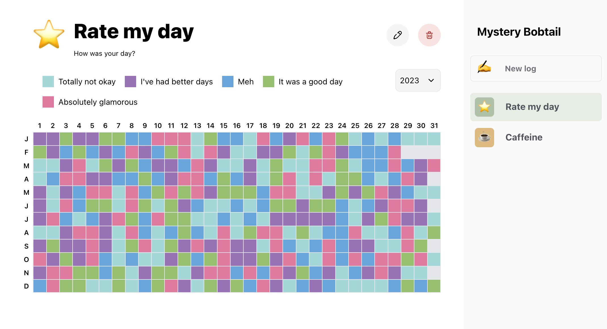

A bullet journal to make daily logs.

To use as Chrome newtab extension, run the build command then upload the dist folder to chrome.

To run the development server:

```bash
npm run dev
# or
yarn dev
```


